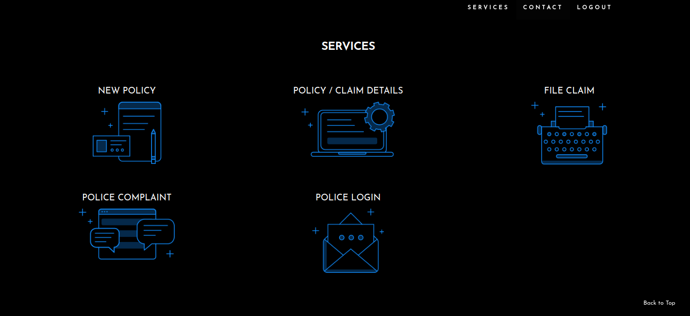

# InsureBlock

This project showcases the use of blockchain in insurance domain for claim processing. In this application, we have two participants, namely insurance and police. Insurance peer is the insurance company providing the insurance for the automobiles and it is responsible for processing the claims. Police peer is responsible for verifying the accident claims.

## Included Components
* Hyperledger Sawtooth
* Docker

<div class="top-screenshot"></div>

<div class="top-screenshot"></div>

## Prerequisites

* [Hyperledger Sawtooth](https://sawtooth.hyperledger.org/release/) - latest
* [Docker](https://www.docker.com/products) - latest
* [Docker Compose](https://docs.docker.com/compose/overview/) - latest
* [NPM](https://www.npmjs.com/get-npm) - latest
* [Node.js](https://nodejs.org/en/download/) - latest
* [Git client](https://git-scm.com/downloads) - latest

## 1. Run the application

Clone the repository:
```bash
git clone https://gitlab.com/shscs911/integrity.git
```
